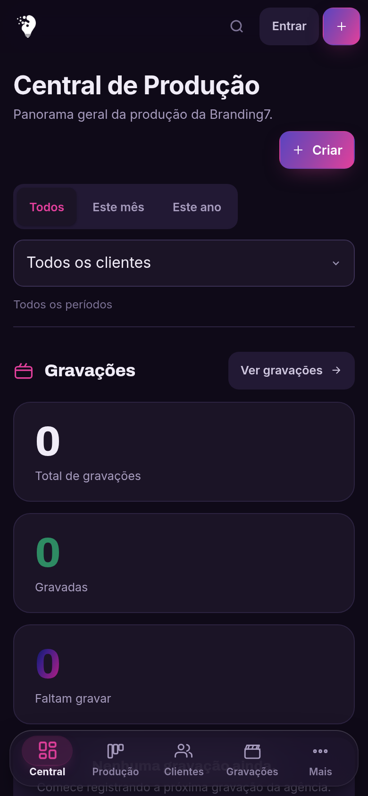
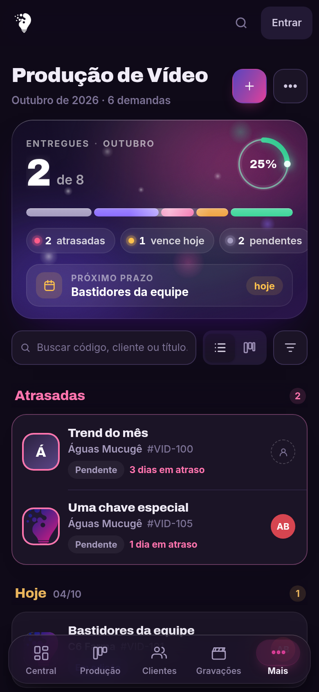
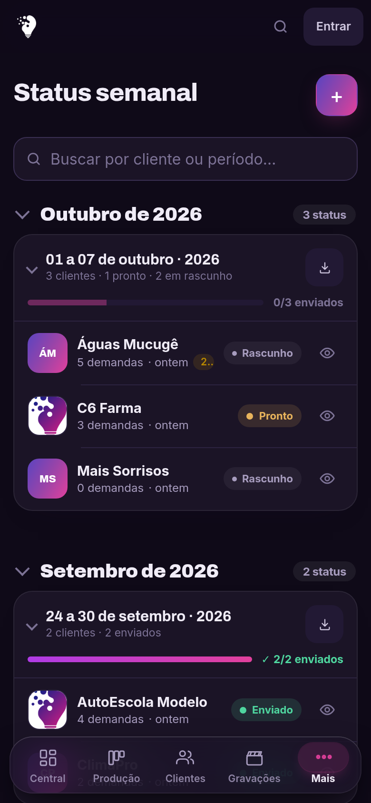
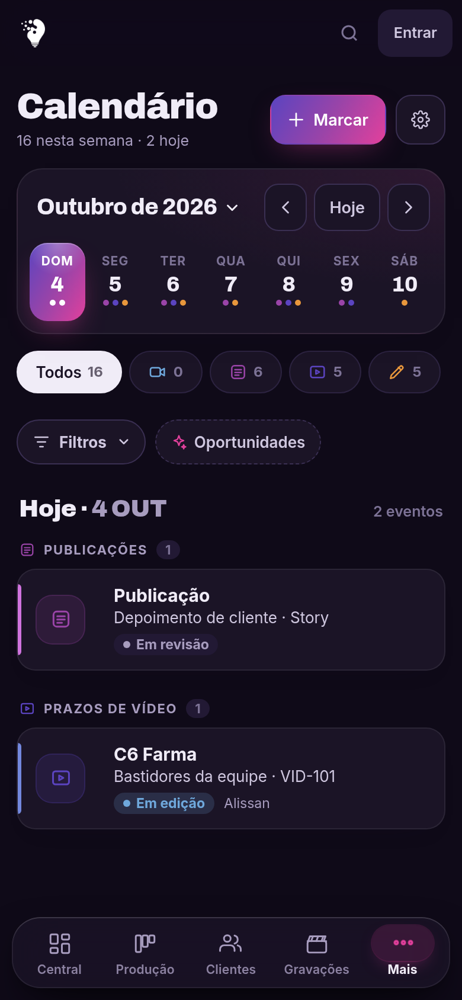
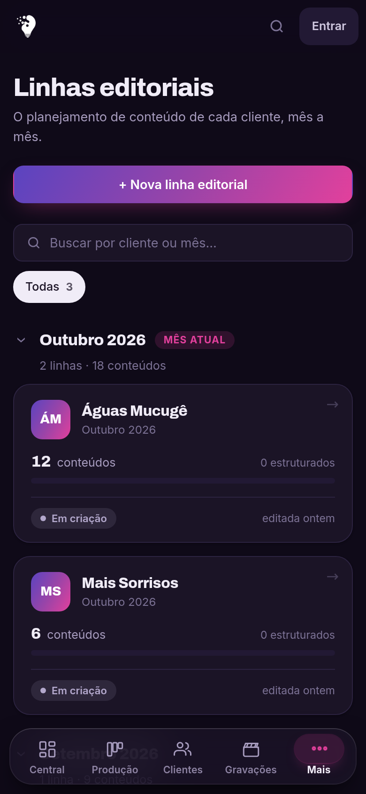
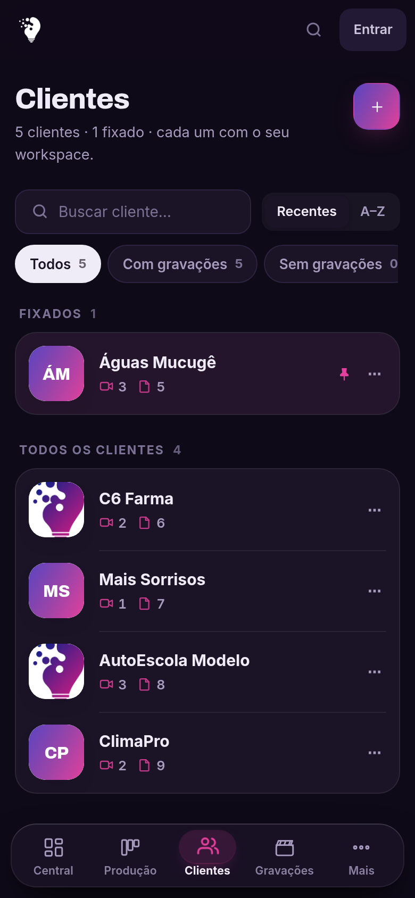
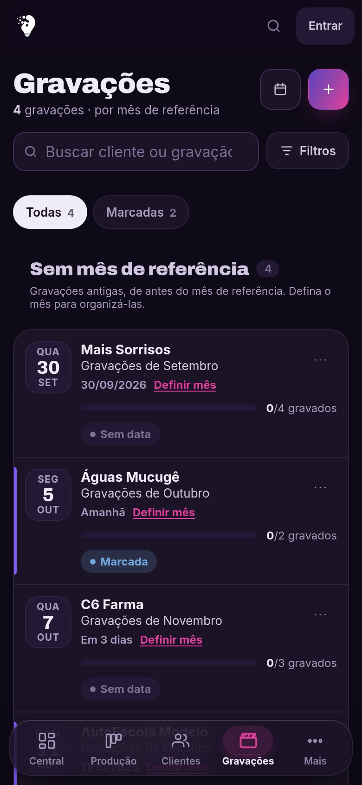
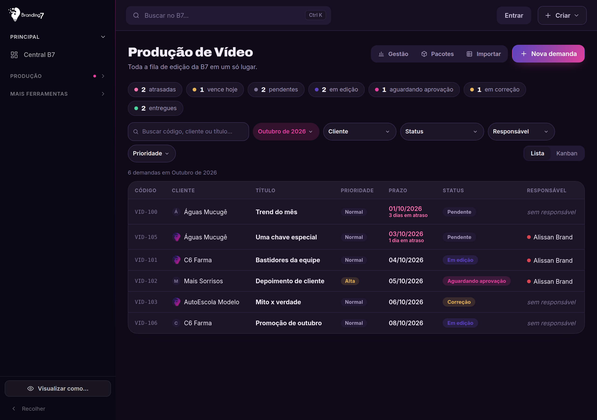

<div align="center">


# Sistema B7

**O sistema de produção de conteúdo da Branding7.**<br>
Do planejamento do mês à entrega para o cliente, num lugar só.

<a href="https://branding7dados-lab.github.io/sistema-b7/"></a>


<br>






</div>

---

## O que é

O Sistema B7 acompanha o conteúdo da agência do começo ao fim. Cada cliente tem
uma **linha editorial** por mês; dela saem as **gravações**, as demandas de
**vídeo** e as de **design**; o cliente **aprova** pelo portal dele; e o
**status semanal** fecha a conta dos sete dias.

```
Linha editorial  →  Gravação  →  Produção  →  Aprovação  →  Status semanal
   o plano do        roteiros     vídeo e      o cliente      o relatório
   mês do cliente    e cenas      design       vê e aprova    que vai pra ele
```

Não é um gerenciador de tarefas genérico: cada tela conhece o fluxo da agência.
Uma demanda de vídeo sabe de qual conteúdo da linha ela nasceu, e o status
semanal se atualiza sozinho quando o conteúdo é publicado.

---

## As telas

<table>
<tr>
<td width="25%" align="center"><br><b>Central B7</b><br><sub>O panorama do dia: o que atrasou, o que vence, o que está esperando você.</sub></td>
<td width="25%" align="center"><br><b>Produção de vídeo</b><br><sub>A fila de edição em lista ou kanban, com prazo, responsável e versões.</sub></td>
<td width="25%" align="center"><br><b>Design</b><br><sub>As artes por etapa, da produção à aprovação do cliente.</sub></td>
<td width="25%" align="center"><br><b>Status semanal</b><br><sub>O relatório de sete dias, pronto para exportar e enviar.</sub></td>
</tr>
<tr>
<td align="center"><br><b>Linhas editoriais</b><br><sub>O planejamento de cada cliente, mês a mês, com pilares e datas.</sub></td>
<td align="center"><br><b>Clientes</b><br><sub>A carteira da agência, cada um com o espaço dele.</sub></td>
<td align="center"><br><b>Gravações</b><br><sub>Sessões, roteiros e cenas — com teleprompter embutido.</sub></td>
<td align="center"><br><b>Calendário</b><br><sub>Agenda da produção, integrada ao Google Agenda.</sub></td>
</tr>
</table>

<div align="center">

<br><sub><i>A mesma tela no computador: barra lateral, mais colunas e a gestão da equipe.</i></sub>
</div>

---

## O que o sistema faz

<table>
<tr><td width="33%" valign="top">

### 📋 Planejamento
Linha editorial por cliente e por mês, com pilares de conteúdo, posicionamento,
metas e calendário de postagem. Duplicar um mês leva o que você escolher.

</td><td width="33%" valign="top">

### 🎬 Produção
Gravações com roteiros, cenas e teleprompter. Demandas de vídeo e de design em
kanban, com prazo, prioridade, responsável e histórico de versões.

</td><td width="33%" valign="top">

### ✅ Aprovação
Portal próprio do cliente: ele vê só o que foi liberado, comenta e aprova.
Quem pode dar o aval oficial é definido conta por conta.

</td></tr>
<tr><td valign="top">

### 📊 Status semanal
O relatório de sete dias que vai para o cliente, montado a partir da linha
editorial e exportável em PDF ou em lote.

</td><td valign="top">

### 🔔 Avisos
Notificações no aparelho, mesmo com o sistema fechado: prazo vencendo, arte
esperando aprovação, gravação marcada para amanhã.

</td><td valign="top">

### 🤖 IA
Apoio para roteiro, legenda, hashtags e análise da linha editorial — sempre com
o contexto do cliente e dentro das permissões de quem pediu.

</td></tr>
</table>

---

## Quem usa e o que cada um vê

| Papel | Enxerga |
|---|---|
| **Administrador** | Tudo, incluindo contas, acessos e configurações do sistema. |
| **Coordenador** | A produção inteira da agência, sem a administração de contas. |
| **Designer** | A fila de design e o contexto do briefing (linha editorial, em leitura). |
| **Videomaker** | A fila de edição de vídeo e o contexto mínimo do cliente. |
| **Cliente** | Só o portal dele: o que foi liberado, para ver, comentar e aprovar. |

> As permissões valem **no banco**, não só na tela. Esconder um botão não
> protege nada — cada tabela tem política por linha, e o papel vem sempre do
> servidor, nunca do navegador.

---

## Como foi construído

**Sem framework e sem etapa de compilação.** HTML, CSS e JavaScript puros: o que
está no repositório é exatamente o que roda no navegador. Publicar é dar um
merge — o GitHub Pages serve em menos de um minuto, e o sistema avisa sozinho
quando há versão nova.

```
sistema-b7/
├── index.html              a casca: topo, navegação e os contêineres das telas
├── sw.js                   service worker: cache, versão e funcionamento sem rede
├── manifest.json           o que faz virar app instalável no celular
│
├── js/
│   ├── app.js              rotas, arranque e a abertura
│   ├── auth.js             sessão, papéis e troca de conta
│   ├── database.js         toda conversa com o Supabase mora aqui
│   ├── permissoes.js       um lugar só decide o que cada papel alcança
│   ├── ui.js               modais, avisos e as peças compartilhadas
│   │
│   ├── linha.js            linha editorial  ·  conteudo.js   detalhe do conteúdo
│   ├── video.js            produção de vídeo ·  design.js     produção de design
│   ├── semana.js           status semanal    ·  gravacao.js   gravações
│   ├── calendario.js       calendário        ·  portal.js     portal do cliente
│   └── ia*.js              os apoios de IA
│
├── styles/                 um arquivo de estilo por área
├── assets/                 marca, ícones e fontes
├── supabase/functions/     funções de servidor (login, IA, avisos, agenda)
├── migration_*.sql         a história do banco, em ordem
└── testes/                 teste de fumaça que abre todas as telas
```

**Supabase como banco.** 67 tabelas em PostgreSQL, com proteção por linha em
todas elas. Sete funções de servidor cuidam do que não pode viver no navegador:
login, IA, notificações e Google Agenda.

---

## Instalação

<details>
<summary><b>Passo a passo completo</b> — para montar uma cópia nova do zero</summary>

<br>

### 1. Criar o projeto no Supabase

Em <https://supabase.com>, crie uma conta e clique em **New project**. Dê um
nome, guarde a senha do banco e escolha a região **South America (São Paulo)**.
Espere uns dois minutos.

### 2. Criar as tabelas

No menu lateral, **SQL Editor → New query**. Abra o `supabase_setup.sql` deste
projeto, cole tudo e clique em **Run**. Depois rode, na ordem, as migrações
`migration_*.sql` que ainda não estiverem aplicadas.

Deve aparecer "Success". Se der erro, a mensagem costuma dizer exatamente o que
faltou.

### 3. Copiar as chaves

Em **Project Settings → API**, você precisa de dois valores:

| No Supabase aparece como | Para que serve |
|---|---|
| **Project URL** | o endereço do seu banco |
| **anon public** (ou **publishable key**) | a chave que o site usa para conversar com o banco |

> ⚠️ **Nunca copie a chave `service_role`.** Ela é secreta e daria acesso total a
> quem abrisse o site. A chave publicável é pública por natureza — essa pode.

### 4. Colocar no config.js

Abra `js/config.js` e substitua os dois `COLE_AQUI`:

```javascript
window.B7_CONFIG = {
  SUPABASE_URL: 'https://abcdefgh.supabase.co',
  SUPABASE_PUBLISHABLE_KEY: 'sb_publishable_...'
};
```

Se abrir o sistema sem isso, ele mostra uma tela explicando o que falta em vez
de quebrar.

### 5. Publicar no GitHub Pages

Suba os arquivos para um repositório e vá em **Settings → Pages**. Em
**Source**, escolha **Deploy from a branch**; em **Branch**, `main` e a pasta
`/ (root)`.

O arquivo `.nojekyll` parece inútil, mas não é: sem ele o GitHub ignora algumas
pastas. Não apague.

### 6. Criar o primeiro administrador

Siga o `BOOTSTRAP.md`. O modo de bootstrap se desliga sozinho assim que existe
um administrador.

</details>

<details>
<summary><b>Rodar os testes</b></summary>

<br>

O teste de fumaça abre todas as telas num Chromium de verdade, com o banco
simulado, e falha se alguma quebrar ou abrir vazia.

```bash
cd testes
npm install
npm test
```

O GitHub roda sozinho a cada envio — veja `.github/workflows/testes.yml`.

</details>

---

## Publicar uma versão

Toda publicação muda dois números, sempre juntos:

| Arquivo | O quê | Para quê |
|---|---|---|
| `js/auth.js` | `VERSAO` | é o que aparece em Configurações e dispara o aviso de versão nova |
| `sw.js` | `CACHE` | troca o cache do aparelho; sem isso o celular fica na versão velha |

Depois é só dar merge na `main`. O GitHub Pages publica em menos de um minuto e
cada aparelho recebe o aviso de atualização.

Cada pacote de mudança tem um relatório próprio (`RELATORIO_*.md`) explicando o
que mudou e por quê — são **156** até agora.

---

## Segurança

- **Tem login**, com cinco papéis e sessão no servidor. O papel vem sempre do
  banco, nunca do navegador.
- **Proteção por linha em todas as tabelas.** Um cliente só alcança os dados
  dele, e só o que foi liberado para ele.
- **Nenhum segredo no repositório.** Só a chave publicável, que é pública por
  natureza. Chaves de IA, de notificação e de agenda ficam como variáveis de
  ambiente das funções de servidor.
- **Texto vindo do banco é sempre neutralizado** antes de ir para a tela, e
  links externos passam por uma peneira.

Encontrou algo? Abra uma issue privada ou fale direto com a equipe — não
descreva a falha num lugar público.

---

## Documentos

| Arquivo | Sobre |
|---|---|
| `BOOTSTRAP.md` | criar o primeiro administrador |
| `CENTRAL.md` | a Central de Conteúdo |
| `SEMANA.md` | o Status Semanal |
| `APROVACOES.md` | o fluxo de aprovação do cliente |
| `IA.md` | como a IA é usada e os limites dela |
| `BRAND.md` | identidade visual |
| `CHECKLIST_TESTES.md` | roteiro de teste manual |
| `RELATORIO_HISTORICO_COMPLETO.md` | a história do sistema |

---

<div align="center">
<sub>Feito para a <b>Branding7</b> · Vitória da Conquista, BA</sub>
</div>
